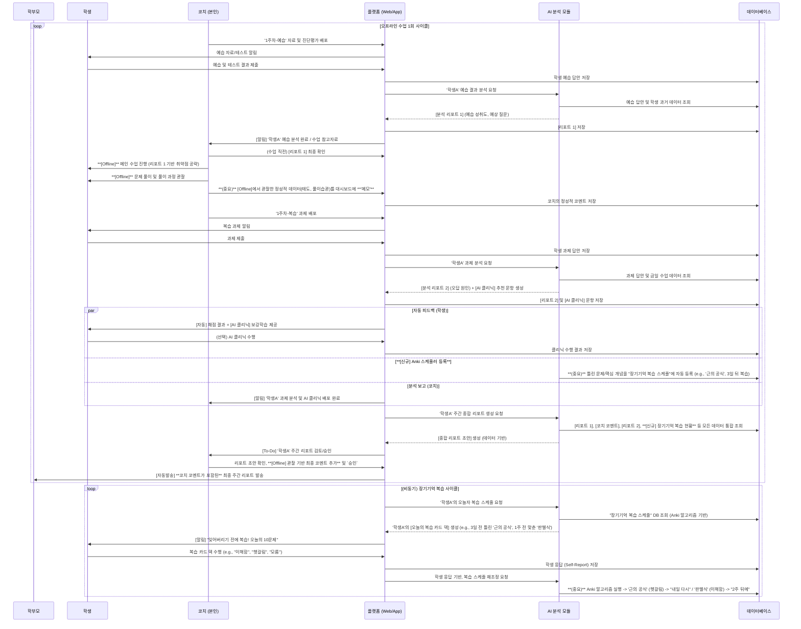

# PACER 시스템 워크플로우 문서

## 1. 개요

본 문서는 PACER 교육 플랫폼의 핵심 워크플로우를 설명합니다. PACER는 오프라인 수업과 온라인 AI 분석을 결합하여 학생에게 개인화된 학습 경험을 제공하고, 코치(선생님)에게는 데이터 기반의 효율적인 코칭을, 학부모에게는 상세한 학습 리포트를 제공하는 것을 목표로 합니다.

시스템은 크게 두 가지 주요 사이클로 구성됩니다.

1.  **주간 수업 사이클:** 예습, 본수업(오프라인), 복습, 리포팅으로 이어지는 주 단위 학습 관리 플로우입니다.
2.  **장기기억 복습 사이클:** 에빙하우스 망각 곡선 이론에 기반한 Anki 알고리즘을 활용하여 학습 내용을 장기기억으로 전환시키는 비동기 복습 플로우입니다.

---

## 2. 참여 주체 (Actors)

| 참여자 | 역할 |
| :--- | :--- |
| **학생 (Student)** | 학습의 주체. 예습, 복습, AI 클리닉, 장기기억 퀴즈 등을 수행합니다. |
| **코치 (Coach)** | 수업 및 학생 관리를 담당. 오프라인 수업을 진행하고, 학생의 정성적 데이터를 시스템에 기록하며, 최종 리포트를 검수 및 발송합니다. |
| **학부모 (Parent)** | 학생의 학습 과정 및 결과에 대한 최종 리포트를 수신합니다. |
| **플랫폼 (Platform)** | Web/App 형태의 서비스. 학습 콘텐츠 제공, 데이터 입출력, 알림 발송 등 모든 상호작용의 중심 허브 역할을 합니다. |
| **AI 분석 모듈 (AI Module)** | 학생의 학습 데이터를 분석하여 리포트를 생성하고, 개인화된 클리닉 문항을 추천하며, 복습 스케줄을 관리합니다. |
| **데이터베이스 (DB)** | 학생의 모든 학습 데이터, 코치의 코멘트, AI 분석 리포트 등 시스템의 모든 정보를 저장합니다. |

---

## 3. 핵심 워크플로우

### 3.1. 주간 수업 사이클 (Weekly Cycle)

한 번의 오프라인 수업을 중심으로 진행되는 1주일 단위의 핵심 사이클입니다.

#### **1단계: 수업 전 (Pre-Class)**

1.  **자료 배포:** 코치가 주차에 맞는 예습 자료와 진단 평가를 플랫폼을 통해 배포합니다.
2.  **예습 수행:** 학생은 알림을 받고 예습을 진행한 후, 진단 평가 결과를 제출합니다.
3.  **1차 분석:**
    *   플랫폼은 학생의 예습 결과를 AI 분석 모듈로 전달합니다.
    *   AI 모듈은 학생의 과거 데이터와 현재 예습 결과를 종합하여 **[분석 리포트 1]**을 생성합니다. (예상 성취도, 취약 개념, 예상 질문 등 포함)
4.  **코치 전달:** 분석 완료된 리포트는 코치에게 알림과 함께 전달되어, 오프라인 수업의 참고 자료로 활용됩니다.

#### **2단계: 본 수업 (Main-Class, Offline)**

1.  **수업 설계:** 코치는 수업 직전, AI가 제공한 **[분석 리포트 1]**을 최종 확인하여 학생의 취약점을 공략하는 방향으로 수업을 설계합니다.
2.  **오프라인 수업:** 코치는 학생과 1:1 또는 소그룹으로 메인 수업을 진행합니다.
3.  **정성적 데이터 기록 (핵심):** 코치는 수업 중 관찰한 학생의 **정성적 데이터** (문제 풀이 습관, 학습 태도, 특정 개념에 대한 이해도 등)를 플랫폼 대시보드에 **'메모' 형태로 직접 기록**합니다. 이 데이터는 AI가 파악할 수 없는 중요한 분석 자료가 됩니다.

#### **3단계: 수업 후 (Post-Class)**

1.  **과제 배포:** 코치가 해당 주차의 복습 과제를 플랫폼을 통해 배포합니다.
2.  **과제 수행:** 학생은 과제를 수행하고 플랫폼에 제출합니다.
3.  **2차 분석:**
    *   플랫폼은 학생의 과제 결과를 AI 분석 모듈로 전달합니다.
    *   AI 모듈은 과제 답안, 수업 중 코치의 정성적 메모 등을 종합하여 **[분석 리포트 2]**를 생성합니다. (오답의 구체적인 원인 분석)
    *   동시에, 틀린 문제와 연관된 **[AI 클리닉]** 보강 문항을 자동으로 생성합니다.
4.  **피드백 및 후속 학습:**
    *   **(학생)** 채점 결과와 함께 개인화된 **[AI 클리닉]**이 학생에게 제공되어 즉각적인 보강 학습을 유도합니다.
    *   **([신규] Anki 등록)** AI 모듈은 틀린 문제나 핵심 개념을 **"장기기억 복습 스케줄"** 데이터베이스에 자동으로 등록합니다. (예: '근의 공식' 개념, 3일 뒤 복습 예정)
    *   **(코치)** 학생의 과제 분석 및 AI 클리닉 배포 완료 현황을 알림으로 받습니다.

#### **4단계: 주간 리포팅 (Reporting)**

1.  **종합 리포트 초안 생성:**
    *   플랫폼이 AI 모듈에 주간 종합 리포트 생성을 요청합니다.
    *   AI 모듈은 해당 주간의 모든 데이터([리포트 1], [코치 코멘트], [리포트 2], [장기기억 복습 현황] 등)를 통합하여 리포트 초안을 생성합니다.
2.  **코치 검수 및 최종 코멘트:**
    *   코치는 AI가 작성한 데이터 기반 리포트 초안을 확인합니다.
    *   오프라인 수업에서 관찰한 내용을 바탕으로, **최종 코치 코멘트를 추가**하여 리포트를 완성하고 `승인`합니다.
3.  **학부모 발송:** 코치가 승인한 최종 리포트는 학부모에게 자동으로 발송됩니다.

### 3.2. 장기기억 복습 사이클 (Anki-based Loop)

주간 사이클과 별개로, 매일 또는 주기적으로 비동기 실행되는 사이클입니다.

1.  **복습 카드 생성:**
    *   플랫폼이 AI 모듈에 오늘 날짜에 복습해야 할 스케줄을 요청합니다.
    *   AI 모듈은 "장기기억 복습 스케줄" DB를 조회하여 Anki 알고리즘에 따라 **[오늘의 복습 카드 덱]**을 생성합니다. (예: 3일 전 틀렸던 '근의 공식', 1주일 전 맞췄던 '판별식' 등)
2.  **복습 수행:** 학생은 "잊어버리기 전에 복습!"과 같은 알림을 받고, 복습 카드 덱을 수행합니다. 각 카드에 대해 "이해함", "헷갈림", "모름" 등 자신의 상태를 직접 표시(Self-Report)합니다.
3.  **복습 스케줄 재조정 (핵심):**
    *   플랫폼은 학생의 응답을 AI 모듈에 전달합니다.
    *   AI 모듈은 Anki 알고리즘을 실행하여 다음 복습 주기를 동적으로 재조정합니다.
        *   (예시) '근의 공식' (헷갈림) → "내일 다시 복습"
        *   (예시) '판별식' (이해함) → "2주 뒤에 다시 복습"

---

## 4. 시퀀스 다이어그램

