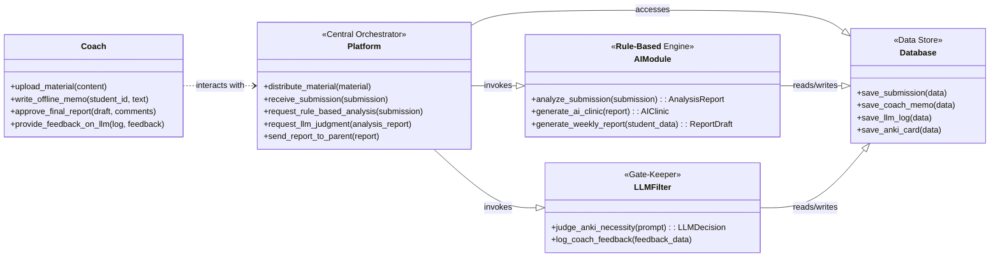

# 🏛️ PACER 시스템 전체 클래스 다이어그램 (V1 - 비용 최적화)

## 1. 개요

본 문서는 **비용 효율적인 V1 아키텍처**에 기반하여 PACER 시스템을 구성하는 핵심 클래스의 정적 구조를 정의합니다. V1의 핵심 목표는 값비싼 MLOps 파이프라인을 배제하고, LLM 호출을 최소화하여 저비용으로 핵심 가설을 검증하는 것입니다.

## 2. 클래스 다이어그램 (V1)

## 3. V1 주요 변경점

*   **AIModule**: 클래스 설명에 **`<<Rule-Based Engine>>`**을 명시하여, V1에서는 LLM을 호출하지 않는 규칙 기반 시스템임을 분명히 합니다. `analyze_submission()`은 정답 비교, 키워드 매칭 등의 로직을 수행합니다.
*   **LLMFilter**: `learn_from_feedback()` 메소드가 **`log_coach_feedback()`**으로 변경되었습니다. 이는 V1에서 코치의 피드백이 자동 파인튜닝에 사용되는 것이 아니라, 향후 프롬프트 엔지니어링을 위해 데이터베이스에 **기록(Logging)**되는 것을 의미합니다. 또한 `judge_anki_necessity()`는 전체 리포트 대신 경량화된 `prompt`를 입력받습니다.