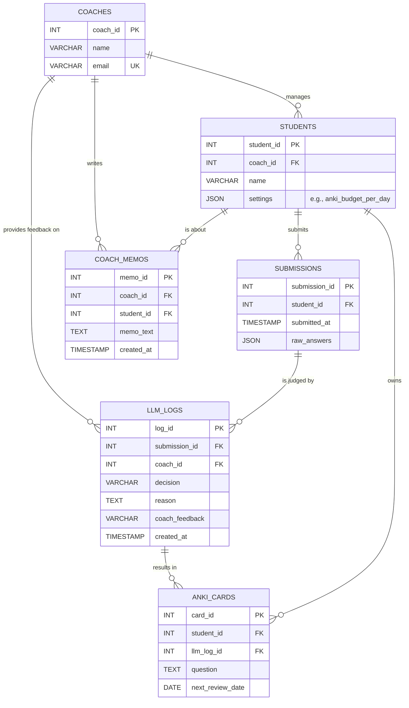

# 🗃️ PACER 데이터베이스 스키마 (V1 - 비용 최적화)

## 1. 개요

본 문서는 PACER 시스템 V1에서 사용되는 데이터베이스의 논리적 구조를 정의합니다. V1의 목표는 대규모 트래픽에도 안정적인 성능을 유지하고, 저장 비용을 효율적으로 관리하는 것입니다.

## 2. ERD (Entity-Relationship Diagram)

## 3. 테이블 명세

(... `STUDENTS`, `SUBMISSIONS` 등 이전 테이블 명세 생략 ...)

### `STUDENTS`
* 학생의 기본 정보와 개인 설정(Pacer 예산 등)을 저장합니다.

| Column | Data Type | Key | Not Null | Description |
| :--- | :--- | :--- | :--- | :--- |
| `student_id` | VARCHAR(255) | PK | Y | 학생 고유 ID |
| `name` | VARCHAR(255) | | Y | 학생 이름 |
| `settings` | JSON | | N | 학생 개인 설정 (e.g., `{"anki_budget_per_day": 20}`) |

### `LLM_LOGS`
* `LLMFilter`가 내린 모든 판단과 그에 대한 코치의 피드백을 기록합니다. **코치의 피드백 조회를 위해 최적화되어야 합니다.**

| Column | Data Type | Key | Not Null | Description |
| :--- | :--- | :--- | :--- | :--- |
| `log_id` | INT | PK | Y | 로그 고유 ID |
| `submission_id` | INT | FK | Y | 판단의 대상이 된 제출물 ID |
| `coach_id` | VARCHAR(255) | FK | Y | 해당 학생의 담당 코치 ID |
| `decision` | VARCHAR(32) | | Y | LLM의 판단 (`APPROVE`, `REJECT`) |
| `reason` | TEXT | | N | 판단 근거 (e.g., 'CONCEPT_ERROR') |
| `coach_feedback`| VARCHAR(32) | | N | 코치의 피드백 (`GOOD`, `BAD`) |
| `reason_code` | VARCHAR(255) | | N | 피드백 사유 코드 (e.g., 'SIMPLE_MISTAKE') |
| `memo` | TEXT | | N | 코치 메모 |
| `created_at` | TIMESTAMP | | Y | 로그 생성 시각 |

#### **V1 성능 최적화: 추천 인덱스**
* 코치의 피드백 화면에서 특정 기간의 로그를 빠르게 조회할 수 있도록, 아래와 같은 복합 인덱스(Composite Index) 생성을 강력히 권장합니다.
* **`idx_coach_logs_by_date (coach_id, created_at DESC)`**: 코치가 자신의 학생 로그를 최신순으로 조회하는 핵심적인 사용 사례를 가속화합니다.

### `ANKI_CARDS`
* `LLMFilter`의 승인을 통해 생성된 모든 Anki 복습 카드를 저장하고 스케줄을 관리합니다.

| Column | Data Type | Key | Not Null | Description |
| :--- | :--- | :--- | :--- | :--- |
| `card_id` | INT | PK | Y | Anki 카드 고유 ID |
| `student_id` | VARCHAR(255) | FK | Y | 카드 소유 학생 ID (`STUDENTS.student_id`) |
| `llm_log_id` | INT | FK | Y | 이 카드를 생성하게 된 LLM 로그 ID (`LLM_LOGS.log_id`) |
| `question` | TEXT | | Y | 복습 질문 |
| `answer` | TEXT | | Y | 복습 정답 |
| `next_review_date`| DATE | | Y | 다음 복습 예정일 (SM2 알고리즘으로 계산) |
| `interval_days` | INT | | Y | 현재 복습 주기 (일) |
| `ease_factor` | INT | | Y | SM2 알고리즘의 난이도 계수 (기본값 250) |
| `repetitions` | INT | | Y | SM2 알고리즘의 반복 횟수 (기본값 0) |
| `last_reviewed_at`| TIMESTAMP | | N | 마지막 복습 시각 |

(... `COACHES`, `PARENTS`, `MATERIALS`, `COACH_MEMOS` 등 다른 테이블 명세 생략 ...)