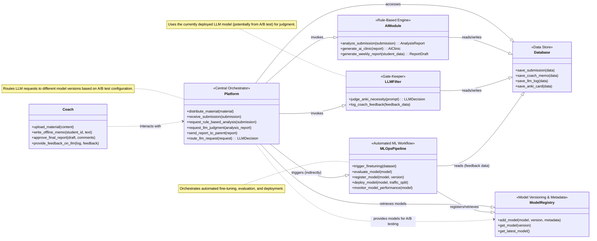

# PACER V2 Class Diagram

```mermaid
classDiagram
    direction LR

    class Platform {
        <<Central Orchestrator>>
        +distribute_material(material)
        +receive_submission(submission)
        +request_rule_based_analysis(submission)
        +request_llm_judgment(analysis_report)
        +send_report_to_parent(report)
        +route_llm_request(request) : LLMDecision
    }

    class AIModule {
        <<Rule-Based Engine>>
        +analyze_submission(submission) : AnalysisReport
        +generate_ai_clinic(report) : AIClinic
        +generate_weekly_report(student_data) : ReportDraft
    }

    class LLMFilter {
        <<Gate-Keeper>>
        +judge_anki_necessity(prompt) : LLMDecision
        +log_coach_feedback(feedback_data)
    }

    class Coach {
        +upload_material(content)
        +write_offline_memo(student_id, text)
        +approve_final_report(draft, comments)
        +provide_feedback_on_llm(log, feedback)
    }

    class Database {
        <<Data Store>>
        +save_submission(data)
        +save_coach_memo(data)
        +save_llm_log(data)
        +save_anki_card(data)
    }

    class MLOpsPipeline {
        <<Automated ML Workflow>>
        +trigger_finetuning(dataset)
        +evaluate_model(model)
        +register_model(model, version)
        +deploy_model(model, traffic_split)
        +monitor_model_performance(model)
    }

    class ModelRegistry {
        <<Model Versioning & Metadata>>
        +add_model(model, version, metadata)
        +get_model(version)
        +get_latest_model()
    }

    Platform --|> AIModule : invokes
    Platform --|> LLMFilter : invokes
    Platform --|> Database : accesses
    Platform --|> MLOpsPipeline : triggers (indirectly)
    Platform --|> ModelRegistry : retrieves models

    Coach ..> Platform : interacts with
    AIModule --|> Database : reads/writes
    LLMFilter --|> Database : reads/writes

    MLOpsPipeline --|> Database : reads (feedback data)
    MLOpsPipeline --|> ModelRegistry : registers/retrieves
    ModelRegistry <.. Platform : provides models for A/B testing

    note for Platform "Routes LLM requests to different model versions based on A/B test configuration."
    note for LLMFilter "Uses the currently deployed LLM model (potentially from A/B test) for judgment."
    note for MLOpsPipeline "Orchestrates automated fine-tuning, evaluation, and deployment."
```