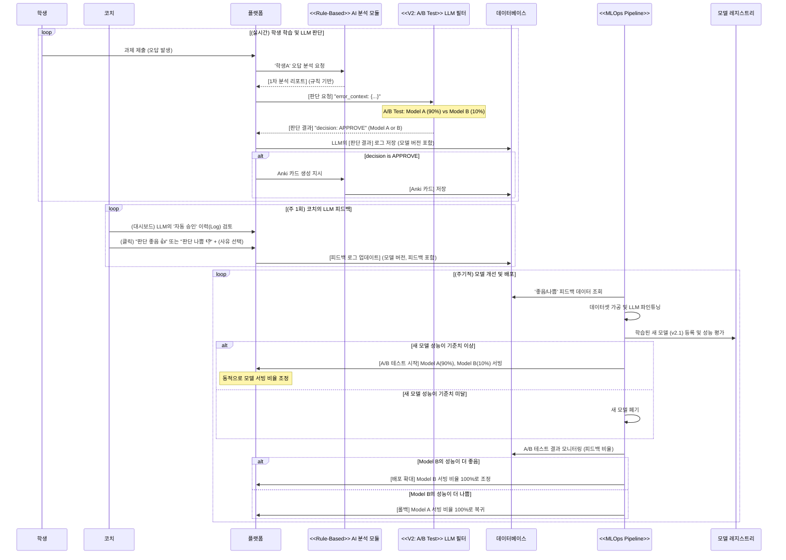

# PACER V2 Sequence Diagram

```mermaid
sequenceDiagram
    participant Student as 학생
    participant Coach as 코치
    participant Platform as 플랫폼
    participant AIModule as <<Rule-Based>> AI 분석 모듈
    participant LLMFilter as <<V2: A/B Test>> LLM 필터
    participant DB as 데이터베이스
    participant MLOps as <<MLOps Pipeline>>
    participant ModelRegistry as 모델 레지스트리

    %% --- 1. 실시간 자동화 루프 (V2) --- 
    loop (실시간) 학생 학습 및 LLM 판단
        Student->>Platform: 과제 제출 (오답 발생)
        Platform->>AIModule: '학생A' 오답 분석 요청
        AIModule-->>Platform: [1차 분석 리포트] (규칙 기반)
        
        Platform->>LLMFilter: [판단 요청] "error_context: {...}"
        note over LLMFilter: A/B Test: Model A (90%) vs Model B (10%)
        LLMFilter-->>Platform: [판단 결과] "decision: APPROVE" (Model A or B)
        
        Platform->>DB: LLM의 [판단 결과] 로그 저장 (모델 버전 포함)
        alt decision is APPROVE
            Platform->>AIModule: Anki 카드 생성 지시
            AIModule->>DB: [Anki 카드] 저장
        end
    end

    %% --- 2. 코치의 비동기 피드백 루프 (V2) --- 
    loop (주 1회) 코치의 LLM 피드백
        Coach->>Platform: (대시보드) LLM의 '자동 승인' 이력(Log) 검토
        Coach->>Platform: (클릭) "판단 좋음 👍" 또는 "판단 나쁨 👎" + (사유 선택)
        Platform->>DB: [피드백 로그 업데이트] (모델 버전, 피드백 포함)
    end

    %% --- 3. 자동 파인튜닝 및 A/B 테스트 루프 (V2) --- 
    loop (주기적) 모델 개선 및 배포
        MLOps->>DB: '좋음/나쁨' 피드백 데이터 조회
        MLOps->>MLOps: 데이터셋 가공 및 LLM 파인튜닝
        MLOps->>ModelRegistry: 학습된 새 모델 (v2.1) 등록 및 성능 평가

        alt 새 모델 성능이 기준치 이상
            MLOps->>Platform: [A/B 테스트 시작] Model A(90%), Model B(10%) 서빙
            note over Platform: 동적으로 모델 서빙 비율 조정
        else 새 모델 성능이 기준치 미달
            MLOps->>MLOps: 새 모델 폐기
        end

        MLOps->>DB: A/B 테스트 결과 모니터링 (피드백 비율)
        alt Model B의 성능이 더 좋음
            MLOps->>Platform: [배포 확대] Model B 서빙 비율 100%로 조정
        else Model B의 성능이 더 나쁨
            MLOps->>Platform: [롤백] Model A 서빙 비율 100%로 복귀
        end
    end
```